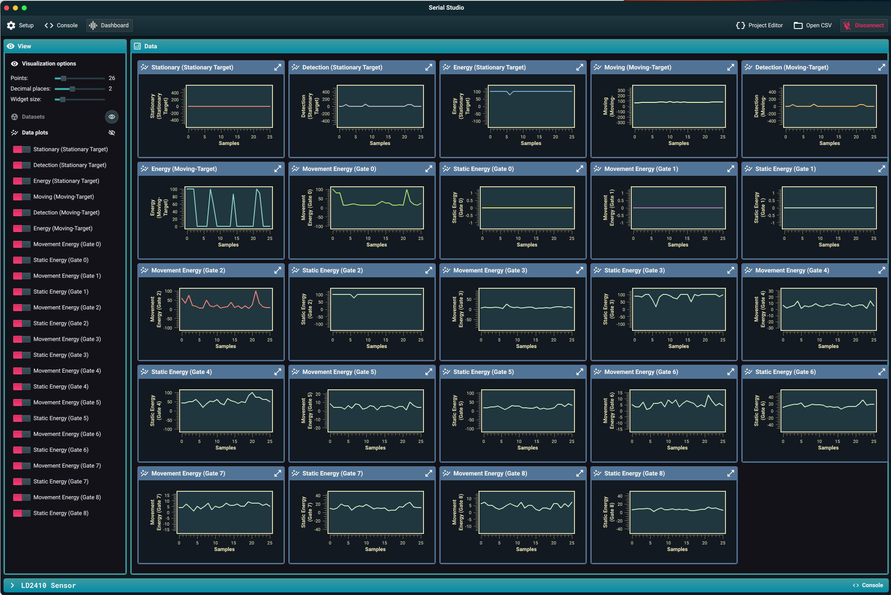

# SknLD2410
ESP32 Program that explores the LD2410 mmWave Human Detection Sensor

Example sketch for reporting on readings from the LD2410 using 
whatever settings are currently configured. The ability to change
the device configuration is enabled via command over Serial or UDP transports.

The sketch assumes an ESP32 board with the LD2410 connected as Serial2 
on pins 16 & 17, the serial configuration for other boards may vary. ESP8266 boards 
may also work but not tried.

The Program broadcasts [reporting data] on UDP port 8090, and listens on 
UDP port 8091 for commands or configuration requests, 
responses are sent to the callers ip/port as discovered.

Where [reporting data] is CSV-like with attributes as
documented in [SerialStudio's page](https://github.com/Serial-Studio/Serial-Studio/wiki/Communication-Protocol)

WIFI_SSID and WIFI_PASS are double-quoted environment variables with related values, A strategy used 
to avoid documenting WiFi credentials in the open.

### examples: 

    export PLATFORMIO_BUILD_FLAGS=-DWIFI_PASS='"ssid-password"' -DWIFI_SSID='"ssid-value"'

or 

    export WIFI_PASS='"ssid-password"'
    export WIFI_SSID='"ssid-value"'


### Gates: 
- each gate is 0.75m or 30 inches
 0 to 9 gates = 6.75m or 22 feet ish

Replace the IPAddress() values with IP Address of the machine running SerialStudio and deploy to ESP32. 


## Serial Console Log or using UDP and netstat: "$ nc -u 10.100.1.244 8091"
```
.WiFi connected with IP: 10.100.1.244
Client Listening on port: 8091
Client Initialized...
Sensor Initialized...
setup() Complete...

Supported commands:
	( 1) help:         this text.
	( 2) streamstart:  start sending udp data to SerialStudio.
	( 3) streamstop:   stop sending to SerialStream.
	( 4) read:         read current values from the sensor
	( 5) readconfig:   read the configuration from the sensor
	( 6) setmaxvalues <motion gate> <stationary gate> <inactivitytimer> (2-8) (0-65535)seconds
	( 7) setsensitivity <gate> <motionsensitivity> <stationarysensitivity> (2-8|255) (0-100)
	( 8) restart:      restart the sensor
	( 9) readversion:  read firmware version
	(10) factoryreset: factory reset the sensor
	(11) deviceinfo:   LD2410 device info
	(12) reboot:       reboot hosting micro-controller


 choose> 4

Reading from sensor: OK
Moving target: 76 cm energy: 100 dBZ

 choose:> 4

Reading from sensor: OK
No Detection, in Idle Hold window of: 5 seconds

 choose:> 5

Reading configuration from sensor: OK
Maximum gate ID: 8
Maximum gate for moving targets: 8
Maximum gate for stationary targets: 8
Idle time for targets: 5s
Gate sensitivity
Gate 0 moving targets: 50 dBZ stationary targets: 0 dBZ
Gate 1 moving targets: 50 dBZ stationary targets: 0 dBZ
Gate 2 moving targets: 40 dBZ stationary targets: 40 dBZ
Gate 3 moving targets: 30 dBZ stationary targets: 40 dBZ
Gate 4 moving targets: 20 dBZ stationary targets: 30 dBZ
Gate 5 moving targets: 15 dBZ stationary targets: 30 dBZ
Gate 6 moving targets: 15 dBZ stationary targets: 20 dBZ
Gate 7 moving targets: 15 dBZ stationary targets: 20 dBZ
Gate 8 moving targets: 15 dBZ stationary targets: 20 dBZ

choose:> 6 8 8 600

Setting max values to gate 8 moving targets, gate 8 stationary targets, 600s inactivity timer: OK, now restart to apply settings

 choose:> 8

Restarting sensor: OK

 choose:> 5

Reading configuration from sensor: OK
Maximum gate ID: 8
Maximum gate for moving targets: 8
Maximum gate for stationary targets: 8
Idle time for targets: 600s
Gate sensitivity
Gate 0 moving targets: 50 dBZ stationary targets: 0 dBZ
Gate 1 moving targets: 50 dBZ stationary targets: 0 dBZ
Gate 2 moving targets: 40 dBZ stationary targets: 40 dBZ
Gate 3 moving targets: 30 dBZ stationary targets: 40 dBZ
Gate 4 moving targets: 20 dBZ stationary targets: 30 dBZ
Gate 5 moving targets: 15 dBZ stationary targets: 30 dBZ
Gate 6 moving targets: 15 dBZ stationary targets: 20 dBZ
Gate 7 moving targets: 15 dBZ stationary targets: 20 dBZ
Gate 8 moving targets: 15 dBZ stationary targets: 20 dBZ

 choose:> 11

LD2410 Device Information for Node: LD2410-Sensor-02
	Data reporting mode: Engineering Mode
	Communication protocol version: v1.0
	Communications Buffer Size: 64 bytes
	Device firmare version: v1.7.22091516
	Engineering retain data value: 2051
     
 choose:> 
```

## LD2410 Pinout


The test directory of this repo contains a JSON file formatted for the [SerialStudio application](https://github.com/Serial-Studio/Serial-Studio). 
This ESP program and SerialStudio app provide deep understanding of the LD2410 operation, and 
provides the ability to configure the device to meet your objectives.

## SerialStudio


After using this program to configure the device(s), it is assumed you would simply use the GPIO output which 
goes High on detection of either a moving or stationary target.  The configured values will survive power cycles.

## Contributing

1. Fork it 
2. Create your feature branch (`git checkout -b my-new-feature`)
3. Commit your changes (`git commit -am 'Add some feature'`)
4. Push to the branch (`git push origin my-new-feature`)
5. Create a new Pull Request


## License

The project is available as open source under the terms of the [MIT License](http://opensource.org/licenses/MIT).
